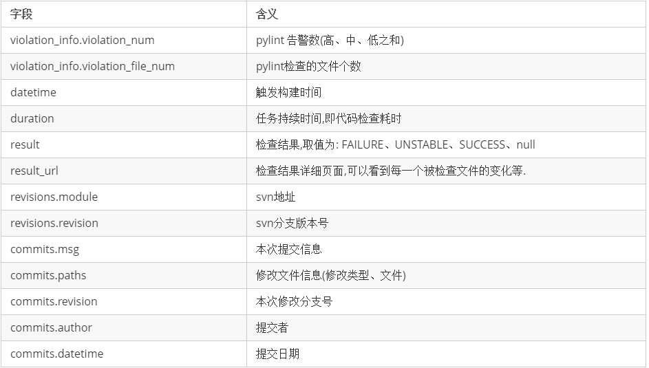
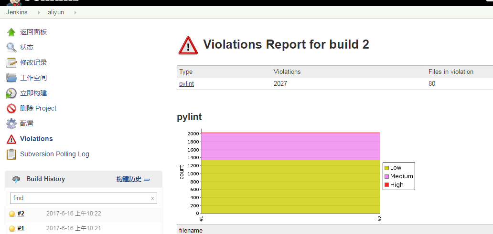

===========
lintjenkins
===========

.. image:: https://img.shields.io/pypi/v/lintjenkins.svg
        :target: https://pypi.python.org/pypi/lintjenkins

.. image:: https://img.shields.io/travis/510908220/lintjenkins.svg
        :target: https://travis-ci.org/510908220/lintjenkins

.. image:: https://readthedocs.org/projects/lintjenkins/badge/?version=latest
        :target: https://lintjenkins.readthedocs.io/en/latest/?badge=latest
        :alt: Documentation Status

.. image:: https://pyup.io/repos/github/510908220/lintjenkins/shield.svg
     :target: https://pyup.io/repos/github/510908220/lintjenkins/
     :alt: Updates

jenkins pylint api.

* Free software: MIT license
* Documentation: https://lintjenkins.readthedocs.io.

Require
--------

1. **目标机器装有jenkins+violations**

2. **被检查的python代码所在目录符合包的形式,如**:

    - `__init__.py`
    - `requirements.txt`
    - `pylint.cfg`

3. **pylint配置文件也需要修改**.

    - 没有配置可以使用`pylint --generate-rcfile > pylint.cfg`生成配置.
    - 将`output-format`项的值改为`parseable`
    - `init-hook`添加`'import sys; sys.path.append("/var/lib/jenkins/workspace/xxx")'`,`xxx`为jenkins job名. 否则会出现`W0403 Relative import 'xxxx'警告`

Example
--------
.. code-block:: python

   In [2]: from lintjenkins import LintJenkins

   In [3]: lint_jenkins = LintJenkins('http://x.x.x.x:8080', username='username', password='password')

   In [4]: lint_jenkins.add_job(svn = 'svn', username='username', password='password',job_name='aliyun')

   In [7]: lint_jenkins.get_build_numbers('aliyun')
   Out[7]: [2, 1]

   In [8]: lint_jenkins.get_build_info('aliyun',2)
   Out[8]: 
        {
            "violation_info": {
                "violation_num": 2027,
                "violation_file_num": 80
            },
            "commits": [
                {
                    "msg": "svn提交信息",
                    "paths": [
                        {
                            "editType": "add",
                            "file": "新增的文件"
                        },
                        {
                            "editType": "edit",
                            "file": "编辑的文件"
                        }
                    ],
                    "revision": 18830,
                    "datetime": "2017-06-12 09:44:38",
                    "author": "huzhongzhong"
                }
            ],
            "datetime": "2017-06-12 09:55:13",
            "result_url":'http://x.x.x.x:8080/job/job_name/7/violations/'
            "result": "UNSTABLE",
            "duration": 49,
            "revisions": [
                {
                    "module": "svn地址",
                    "revision": 18830
                }
            ]
        }

字段说明:

对应的在jenkins上的表现是:

Credits
---------

This package was created with Cookiecutter_ and the `audreyr/cookiecutter-pypackage`_ project template.

.. _Cookiecutter: https://github.com/audreyr/cookiecutter
.. _`audreyr/cookiecutter-pypackage`: https://github.com/audreyr/cookiecutter-pypackage

